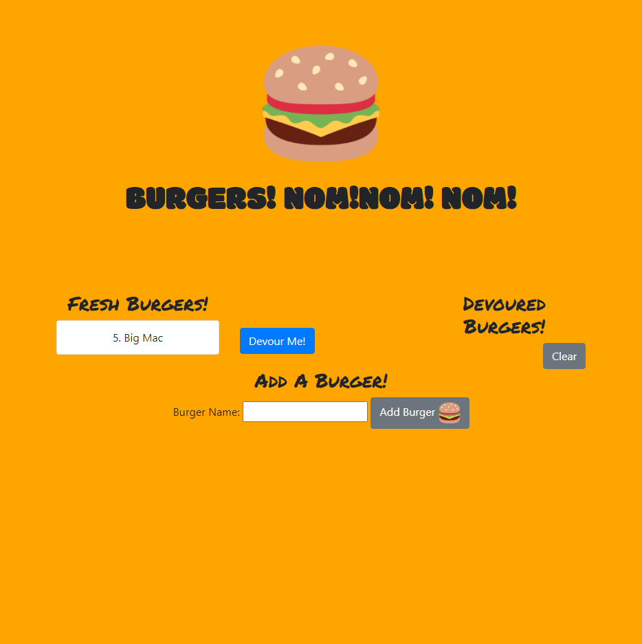
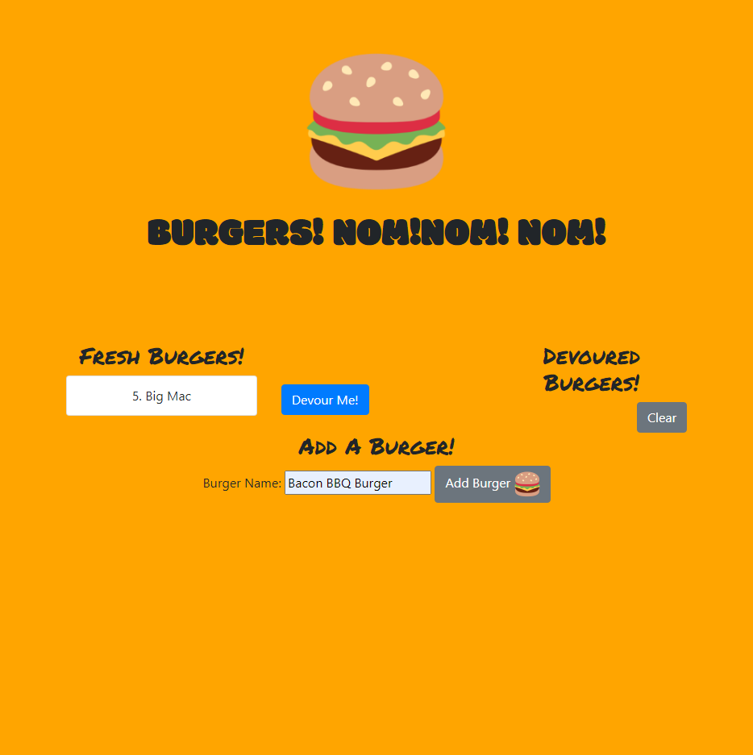
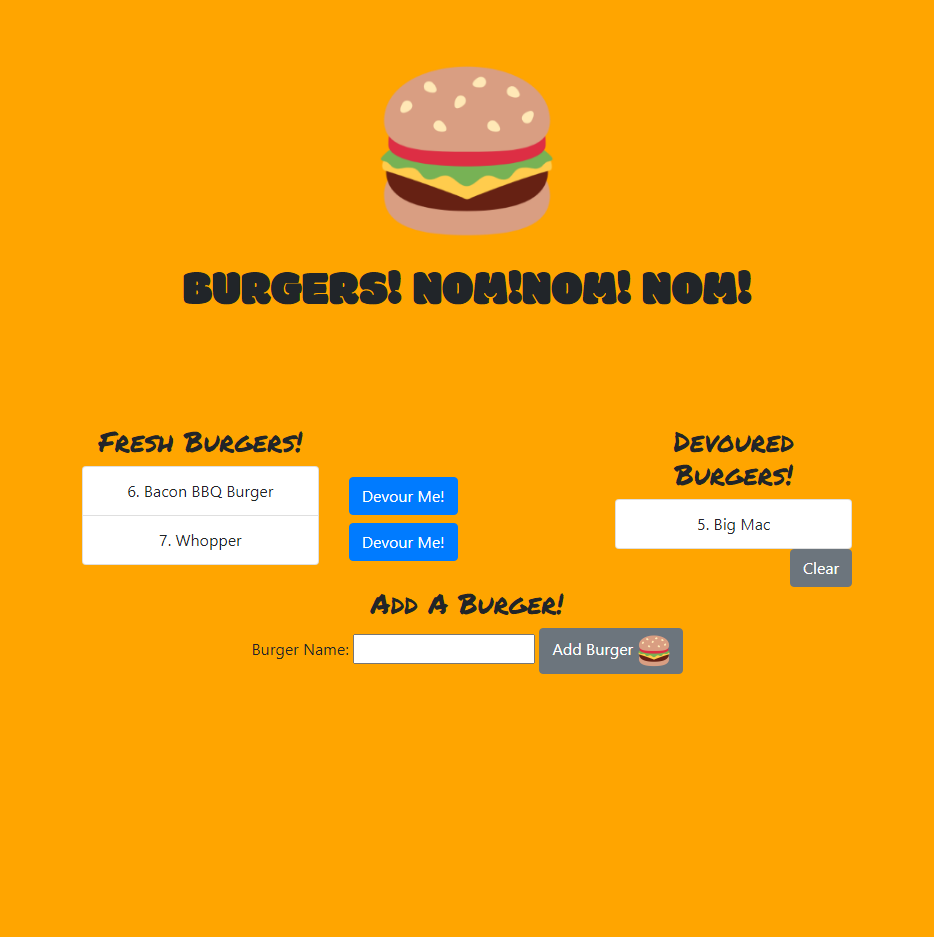

# Burger-App

## Description:

    This application allows the user to enter a series of burgers and store them in a list. They can then choose to devour specific burgers and the devoured ones will be stored in a seperate list so the user can view all the burgers they have eaten over time.

# Table of Contents

- [Description](#description)
- [Installation](#installation)
- [Technologies](#technologies)
- [Usage](#usage)
- [Contributing](#contributing)
- [Test](#test)
- [Credits](#credits)
- [License](#license)
- [Questions](#questions)

## Installation:

    The user will need to have node installed. Upon opening the app, the user should input into their terminal `npm install` to install dependencies, followed by `node server` to begin the application.

## Technologies:

   - HTML
   - CSS
   - JavaScript
   - Express
   - Handlebars Templating Engine
   - MySQL

## Screenshots:
### Landing Page:

### Add a Burger:

### Devour a Burger:

## Usage:

    The user enters burgers that they wish to eat into the text field, and once they press submit that burger will be logged in a list called 'Fresh Burgers' to the left. When the User has eaten that burger, they can click the 'Devour Me' button and that specific burger will be moved into the 'Devoured Burgers' List to track all the burgers they have eaten.

## Contributing:

    Steve Knapp

## Test:

    No current testing ability at this time. This is something that I will look into implementing in a future update.

## Credits:

    Steve Knapp

## License:

    For more information about the License, click on the link below.

- [License](https://opensource.org/licenses/)

## Questions:

    Please contact me about this program using the following link:

- [GitHub Profile](https://github.com/Stovencrantz)
  For additional questions please reach out to my email at: sknapp143@gmail.com.
  Here is a video on how to work the application.
- [Video](https://drive.google.com/file/d/1vIWhHccnWH5cbOeU6ao7n6haqGUNWwH0/view)
